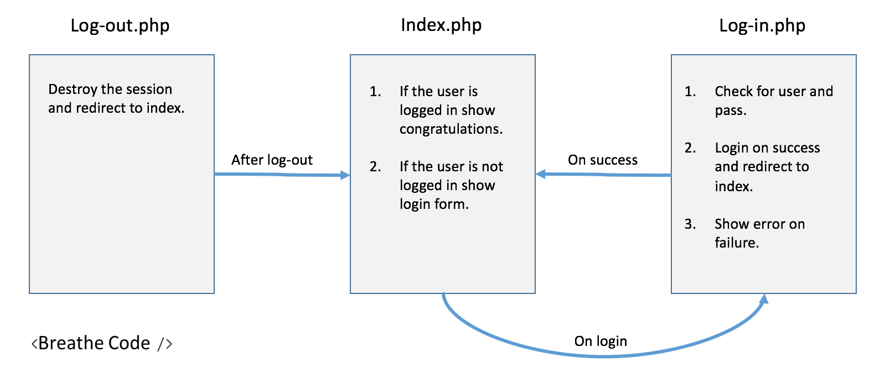

#Log in/out with PHP Sessions

This is a simple example of how to implement the login/logout 
functionality using PHP Sessions without any framwork.

##Fundamentals
This exercise use the basic PHP session functions session_start(), session_close(), session_destroy() to make a login/logut funcitonlity. 

![Loging implementation with PHP Sessions explanation diagram]#Log in/out with PHP Sessions

This is a simple example of how to implement the login/logout 
functionality using PHP Sessions without any framwork.

##Fundamentals
This exercise use the basic PHP session functions session_start(), session_close(), session_destroy() to make a login/logut funcitonlity. 

